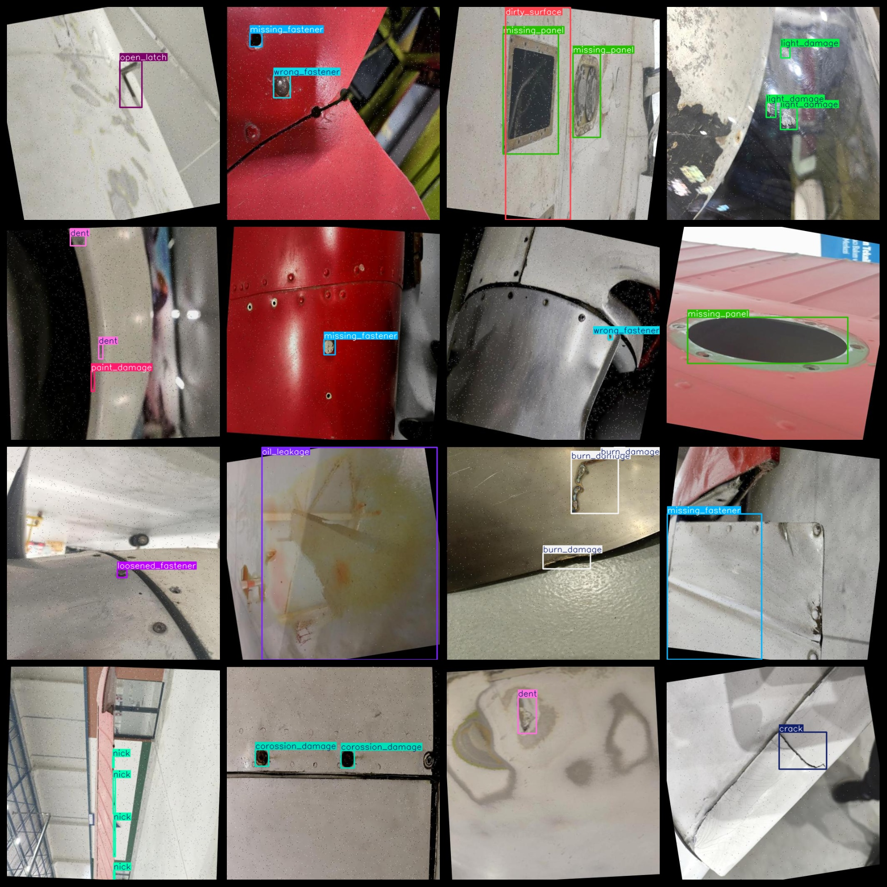

# Aircraft Defect Detection Dataset 32158 Images VOC+YOLO

Aircraft defect detection dataset 32158 VOCs + YOLOs

Dataset Format: Pascal VOC + YOLO (excluding the split-path txt file; only jpg images with corresponding VOC-format xml files and YOLO-format txt files)

Number of images (jpg file count): 32158

Number of xml files: 32,158

Number of txt files: 32158

Category count: 22

The Github repository is: datasets_sl

["broken_discharge", "broken_link", "burn_damage", "corrosion_damage", "crack", "dent", "dirty_surface", "distortion", "light_damage", "loosened_fastener", "missing_fastener", "missing_label", "missing_light", "missing_panel", "nick", "oil_leakage", "open_latch", "paint_damage", "scratch", "unpressurized_tire", "worn_tire", "wrong_fastener"]

Number of boxes labeled in each category:

broken_discharge frame count = 777 (discharge outlet damage)

broken_link frame count = 1719 (connector damage)

burn_damage frame count = 2525 (burn damage)

corossion_damage frame count = 3544 (corrosion damage)

crack frame count = 2806 (crack/fissure)

dent frame count = 2247 (dent)

dirty_surface frame count = 4633 (surface dirt)

distortion frame count = 1235 (deformation)

number of light_damage boxes = 1942 (lamp damage)

loosened_fastener box number = 2754 (loose fasteners)

missing_fastener number of frames = 4517 (missing fasteners)

missing_label box number = 1951 (missing label)

missing_light number of boxes = 1235 (missing lamps)

missing_panel number of frames = 2374 (missing panel/guard)

number of nick frames = 4156 (scratches/bumps)

oil_leakage box number = 2289 (oil leakage)

open_latch number of frames = 2741 (lock/buckle not closed)

paint_damage box number = 4009 (paint damage)

number of scratch boxes = 4105 (scratches)

unpressurized_tire number of frames = 2028 (tire not inflated)

worn_tireFrameNumber = 1328 (tire wear)

wrong_fastener number of frames = 2345 (wrong fasteners/improper use)

Total number of frames: 57260

Number of images per category:

Broken discharge holds a total of 731 images.

Broken link counts = 1085

Burn_damage occupies 2089 images.

Corossion_damage occupies 2253 pictures.

Crack occupies 1917 images.

Number of images owned = 1740

The number of images owned by dirty_surface is 1894.

Distort the image count = 1163

Light Damage Occupies 938 Images

Number of images with loosened fasteners = 1782

Missing fasteners occupy 1437 images.

Missing label counts = 1110

Missing light has 1194 images.

Missing panel has 1719 images.

Nick has 2499 images.

Oil Leakage occupies a total of 2178 images.

The number of images owned by the open_latch = 2720.

Paint damage count = 1728

Scratch has 1657 images.

Unpressurized tire has 1622 images.

Number of worn tires = 1318

The number of wrong fasteners is 1524.

Image Resolution: 512x512
## Images

---

Here is a pay link on Stripe (https://buy.stripe.com/3cs8yP7sY87d0vu9AB). Please contact me lonlonago@foxmail.com after funding $89, and I will send you a complete data files, thank you!

